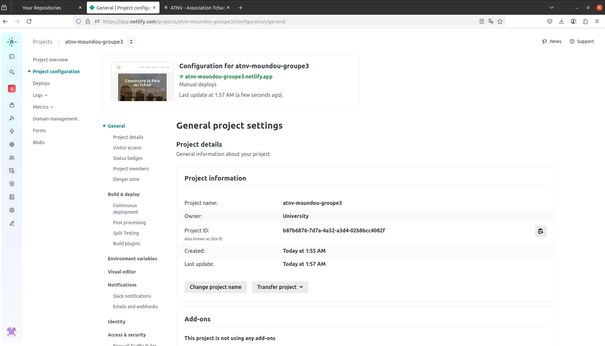

# Présentation du projet : 

Le projet consiste à proposer une solution qui repond aux difficultés que l'Association Tchadienne de Non-Violence (ATNV) rentrent à communiquer 

efficacement dans un environnement digital en constante évolution. Pour cela, elle souhaite donc moderniser sa présence en ligne à travers :

un site internet moderne, responsive et bien référencé.

# Choix technique 

Le choix technique de ce projet s'est porté sur les0 technologies :

----> React + Vite : permet un développement rapide avec une interface dynamique

----> Tailwindcss : facilite un design moderne et responsive sans écrire trop de CSS, et surtout que les fichiers css de tailwind ne pèse pas comme ceux de Bootstraps

----> Hébergement : Netlify qui est un hébergeur gratuit pour les sites conçus en react.

# Capture d'écrant du site en ligne 

